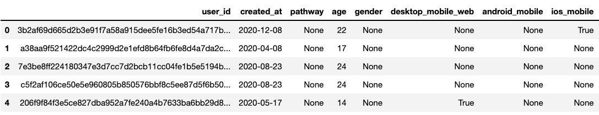

# A Single Source of Truth!
You've just been given an important initiative to help consolidate data across various sources starting with user data. More specifically, create a few notebooks (as many as you'd like, really!) that result in the final dataset looking something like this:

However, there are some requirements!

## Requirements
- Your notebooks must contain organized markdown providing readers with context of your thought process for various data processing tasks
- Data should be imputed along the way. This means, if a user has a `date_of_birth` with no `age`, calculate the `age` based on `date_of_birth`

    **NOTE: Do this wherever you can**
- Create columns that denote the type of device users interact with eFuse on
- All data (columns and rows), should be standardized, following the same conventions
- Each notebook you create should output data into their respective directories (`raw`, `interim`, `processed`)
- You are only allowed to use `pandas` and notebooks. No other package or library may be used!

## Prerequisites
- python: ^3.*
- pandas
- jupyter

## Getting Started
- `git clone git@github.com:QuinnManor/efuse-work-sample-DE.git`
- `cd efuse-work-sample-DE`
- `jupyter notebook`

## When You're Finished!
- Email a zipped folder of your work with the convention `<Lastname_Firstname-efuse-work-sample-DE.zip>` to your recruiter. Meaning, for Matthew Quinn:
    -  `Quinn_Matthew-efuse-work-sample-DE.zip`
- Files/Directories to include in your zip:
    - data/
    - data_sources/
    - notebooks/
    - README.md
    - requirements.txt (optional)

## Evaluation Criteria
I won't give too many details on this (for obvious reasons), but follow directions and send code that works. This means, if you're using `python 3.10.1` have a `requirements.txt` file and a `README` explaining how to run your code (there is more than one way to assure this, just make sure your code runs!).

## Project Organization
------------
    ├── data
    │   ├── interim        <- Intermediate data that has been transformed
    │   ├── processed      <- The final, canonical datasets for modeling
    │   └── raw            <- The original, immutable data dump
    │
    ├── data_sources
    │   ├── mongo          <- User data from MongoDB
    │   ├── segment        <- User data from various Segment sources
    │
    ├── notebooks          <- Where your data processing occurs
    │
    ├── .gitignore         <- Specifies which files to ignore within the repository
    │
    ├── README.md          <- The top-level README for developers using this project
    │
    ├── img.png            <- Image referenced in this README
--------